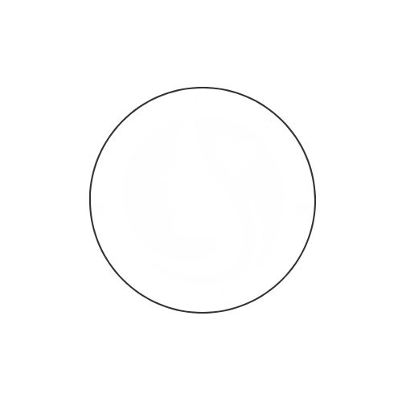
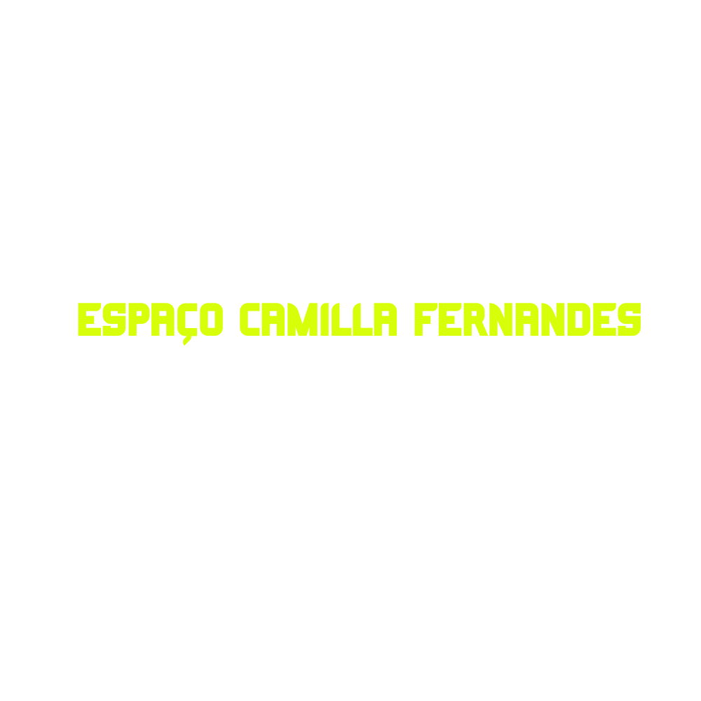

# Projeto de Cabeçalho com HTML e CSS
Este projeto é um exemplo simples de como criar um cabeçalho com imagens usando HTML e CSS. O cabeçalho contém um logo e um menu de navegação, proporcionando uma estrutura básica para um site.


## Estrutura do Projeto
O projeto consiste em dois arquivos principais:

- index.html: O arquivo HTML que define a estrutura do cabeçalho e o layout da página.
- styles.css: O arquivo CSS que estiliza o cabeçalho e os elementos da página.


## Como usar
1. Clone o Repositório.

```bash
git clone <URL-do-repositório>
cd <nome-do-repositório>
```

2.Estrutura de Arquivos
Certifique-se de que os arquivos estão organizados da seguinte forma:
```
├── img
│   ├── full.png
│   └── ECF.png
├── index.html
└── styles.css
```

3.Abrir o Arquivo HTML

Abra o arquivo index.html em um navegador da sua escolha para visualizar o cabeçalho.
4.O script processará o PDF e salvará o CSV extraído no mesmo diretório que o arquivo PDF.

## Exemplo de Código
- HTML index
```bash

  <!DOCTYPE html>
<html lang="pt-BR">
<head>
    <meta charset="UTF-8">
    <meta name="viewport" content="width=device-width, initial-scale=1.0">
    <link rel="stylesheet" href="styles.css">
    <title>Exemplo de Header</title>
</head>
<body>
    <header>
        
        <nav>
            <ul>
                <li>
                    
                </li>
            </ul>
        </nav>
    </header>
    <section>
        <!-- Conteúdo da seção -->
    </section>
</body>
</html>
```

- CSS (styles.css)
```bash
/* Estilos gerais */
* {
    margin: 0;
    padding: 0;
    box-sizing: border-box;
    list-style: none;
    font-family: "Poppins", sans-serif;
}

body {
    background-color: transparent; /* Mude para uma cor desejada */
}

/* Estilos do Header */
header {
    position: relative; /* Alinha os elementos em relação ao cabeçalho */
    width: 100%; /* Largura total */
    height: 100px; /* Defina a altura desejada */
    background-color: transparent; /* Mantenha transparente ou ajuste para uma cor */
}

header .logo {
    position: absolute;
    width: 50vw;
    left: 10%;
    top: 10%; /* Ajuste conforme necessário */
    z-index: 2;
}

header nav {
    position: absolute; /* Posiciona o nav dentro do cabeçalho */
    top: 50%; /* Ajuste para posicionar corretamente */
    left: 10%; /* Ajuste conforme necessário */
    z-index: 2;
}

header nav ul {
    display: flex;
    gap: 20px;
}

header .nav-imagem {
    width: 100px; /* Ajuste o tamanho da imagem */
}

```
## Customização
- Você pode alterar as imagens e a fonte no cabeçalho editando os arquivos full.png e ECF.png na pasta img.
- O CSS pode ser modificado para atender ao seu design, alterando as propriedades de estilo no arquivo styles.css.
- Contribuição
Se você quiser contribuir para este projeto, sinta-se à vontade para abrir uma solicitação de pull ou relatar problemas.
## Licença
Este projeto está sob a Licença MIT.
